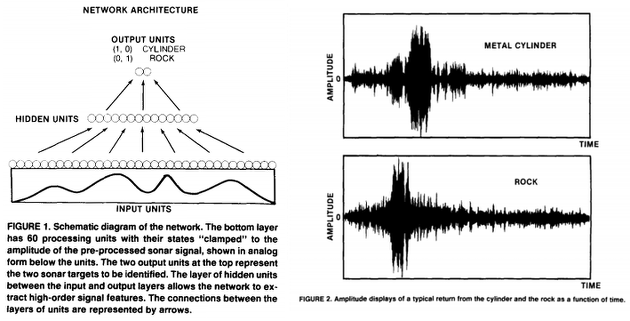
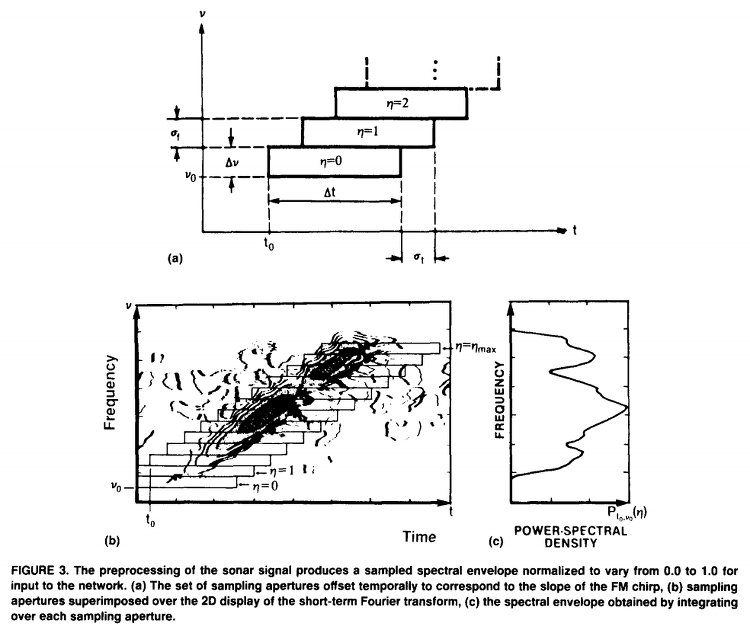

# Playing with Sonar {mlbench}

A bit of gymnastics in [RStudio](https://www.rstudio.com/), [R Markdown](http://rmarkdown.rstudio.com/) and [knitr](https://cran.r-project.org/web/packages/knitr/index.html).

**knitre** quick reference: [knitr in a knutshell](http://kbroman.org/knitr_knutshell/) - [Author's site](http://yihui.name/knitr/)

---

**mlbench**: Machine Learning Benchmark Problems -[CRAN](https://cran.r-project.org/web/packages/mlbench/index.html)- A collection of artificial and real-world machine learning benchmark problems, including, e.g., several data sets from the UCI repository.

Usage (remember install library first: `install.packages("mlbench")`)
```
library(mlbench)
data("Sonar")
```
Format:

> A data frame with 208 observations on 61 variables, all numerical and one (the Class) nominal.

Below a sample of this data frame (`b <- sample(c(1:208), size = 9, replace = FALSE, prob = NULL)`)


```
## [1] "kable(head(Sonar[b, 1:10]), format = 'markdown')"
```


|    |     V1|     V2|     V3|     V4|     V5|     V6|     V7|     V8|     V9|    V10|
|:---|------:|------:|------:|------:|------:|------:|------:|------:|------:|------:|
|17  | 0.0352| 0.0116| 0.0191| 0.0469| 0.0737| 0.1185| 0.1683| 0.1541| 0.1466| 0.2912|
|101 | 0.0629| 0.1065| 0.1526| 0.1229| 0.1437| 0.1190| 0.0884| 0.0907| 0.2107| 0.3597|
|138 | 0.0430| 0.0902| 0.0833| 0.0813| 0.0165| 0.0277| 0.0569| 0.2057| 0.3887| 0.7106|
|166 | 0.0221| 0.0065| 0.0164| 0.0487| 0.0519| 0.0849| 0.0812| 0.1833| 0.2228| 0.1810|
|113 | 0.0454| 0.0472| 0.0697| 0.1021| 0.1397| 0.1493| 0.1487| 0.0771| 0.1171| 0.1675|
|130 | 0.1371| 0.1226| 0.1385| 0.1484| 0.1776| 0.1428| 0.1773| 0.2161| 0.1630| 0.2067|

```
## [1] "kable(head(Sonar[h, 52:61]), format = 'markdown')"
```


|    |    V52|    V53|    V54|    V55|    V56|    V57|    V58|    V59|    V60|Class |
|:---|------:|------:|------:|------:|------:|------:|------:|------:|------:|:-----|
|17  | 0.0346| 0.0158| 0.0154| 0.0109| 0.0048| 0.0095| 0.0015| 0.0073| 0.0067|R     |
|101 | 0.0089| 0.0262| 0.0108| 0.0138| 0.0187| 0.0230| 0.0057| 0.0113| 0.0131|M     |
|138 | 0.0176| 0.0197| 0.0210| 0.0141| 0.0049| 0.0027| 0.0162| 0.0059| 0.0021|M     |
|166 | 0.0089| 0.0051| 0.0015| 0.0075| 0.0058| 0.0016| 0.0070| 0.0074| 0.0038|M     |
|113 | 0.0120| 0.0042| 0.0238| 0.0129| 0.0084| 0.0218| 0.0321| 0.0154| 0.0053|M     |
|130 | 0.0118| 0.0129| 0.0344| 0.0065| 0.0067| 0.0022| 0.0079| 0.0146| 0.0051|M     |


## Physical base

### Sonar, Mines vs. Rocks
[Via UBC](http://ugrad.stat.ubc.ca/R/library/mlbench/html/Sonar.html)

This is the data set used by Gorman and Sejnowski in their study of the classification of sonar signals using a neural network [**1**]. The task is to train a network to discriminate between sonar signals bounced off a metal cylinder and those bounced off a roughly cylindrical rock.

Each pattern is a set of 60 numbers in the range 0.0 to 1.0. Each number represents the energy within a particular frequency band, integrated over a certain period of time. The integration aperture for higher frequencies occur later in time, since these frequencies are transmitted later during the chirp.

The label associated with each record contains the letter "R" if the object is a rock and "M" if it is a mine (metal cylinder). The numbers in the labels are in increasing order of aspect angle, but they do not encode the angle directly.

[**1**]. Gorman, R. P., and Sejnowski, T. J. (1988). "Analysis of Hidden Units in a Layered Network Trained to Classify Sonar Targets" in Neural Networks, Vol. 1, [pp. 75-89](http://citeseerx.ist.psu.edu/viewdoc/download?doi=10.1.1.299.8959&rep=rep1&type=pdf). Same authors almost a year later published: [Learned Classification of Sonar Targets Using a Massively Parallel Network](https://papers.cnl.salk.edu/PDFs/Learned%20Classification%20of%20Sonar%20Targets%20Using%20a%20Massively%20Parallel%20Network%201988-3231.pdf).


### Sonar data and signal representation
From reference [**1**]

The data used for the network experiments were sonar returns collected from a metal cylinder and a cylindrically shaped rock positioned on a sandy ocean floor. Both targets were approximately 5 ft in length and the impinging pulse was a wide-band linear FM [chirp](https://en.wikipedia.org/wiki/Chirp) (ka = 55.6). Returns were collected at a range of 10 meters and obtained from the cylinder at aspect angles spanning 90 � and from the rock at aspect angles spanning 180 �.

<p align="center"></p>

A set of 208 returns (111 cylinder returns and 97 rock returns) were selected from a total set of 1200 returns on the basis of the strength of the specular return (4.0 to 15.0 dB signal-to-noise ratio). An average of 5 returns were selected from each aspect angle. Figure 2 shows a sample return from the rock and the cylinder. The preprocessing of the raw signal was based on experiments with human listeners (Gorman & Sawatari, 1987). The temporal signal was first filtered and spectral information was extracted and used to represent the signal on the input layer.

<p align="center"></p>

The preprocessing used to obtain the spectral envelope is indicated schematically in Figure 3 where a set of sampling apertures (Figure 3a) are superimposed over the 2D display of a [short-term Fourier Transform](https://en.wikipedia.org/wiki/Short-time_Fourier_transform) spectrogram of the sonar return. As shown in Figure 3b and c, the spectral envelope, P,0,v0(~), was obtained by integrating over each aperture. The spectral envelope was composed of 60 spectral samples, normalized to take on values between 0.0 and 1.0. (See Gorman & Sejnowski, 1987 for a detailed treatment of the preprocessing).

## Exploratory amusements

After loading libraries and data,


```r
## Libraries&data
    library(mlbench)
    library(ggplot2)
    library(ggthemes)
    library(caret)
    library('knitr')
    data("Sonar")
```

and creating training and testing sets,


```r
## Train&test
  set.seed(107)
  inTrain <- createDataPartition(y = Sonar$Class, p = .75, list = FALSE)
  training <- Sonar[ inTrain,]
  testing <- Sonar[-inTrain,]
```

I made a quick approach to data by running a few graphical routines on previous, arbitrary, training set. 


```r
# 
for(i in names(training)){   # loop columns
  a <- ggplot(data = training, aes(training[,i],y = Class, coord_fixed(),
                                   col = Class))
  a <- a + geom_point(size=3)
  a <- a + xlab("Signal") + ylab("Mine or Rock") 
  a <- a + ggtitle("Signal by spectral sample and outcome (mine or rock)")
  a <- a + theme_solarized(light = FALSE)+scale_colour_solarized("blue")
  a <- a + xlim(0,1)
  a <- a + annotate("text", x = 0.50, y = 1.2, label = "Mine", colour = "white")
  a <- a + annotate("text", x = 0.50, y = 2.2, label = "Rock", colour = "white")
  a <- a + annotate("text", x = 0.94, y = 2.4, label = i, colour = "yellow", size = 7.5)
                    blue.bold.text <- element_text(face="bold", color="white")
  a <- a + theme(axis.title = blue.bold.text, legend.position="none")
## plot to file
WD0 <- "C:/MyDATA/Routput/SONAR1"   # (use your local disk)
filename=paste(i,".png",sep="")
ggsave(filename, plot = a, path=WD0,width = 16, height = 9, dpi = 120)
print(a)
}
```


And also,


```r
for (j in 1:157) {  # loop observations
      Xvalues <- as.data.frame(1:60)
      Yvalues <- as.data.frame(t(training[j,1:60])) # transpose, row to column
      Signal <- cbind(Xvalues,Yvalues) # two-columns data for observation 'j'
    colnames(Signal) <- c("Spectral sample", "Normalized energy")
    a <- ggplot(data = Signal, aes(x = Xvalues, y = Yvalues, coord_fixed()))
    a <- a + geom_line(lty = 1, color = "gray", size = 0.3, na.rm = TRUE)
    a <- a + xlab("Spectral sample") + ylab("Normalized energy") 
    a <- a + ggtitle("Signal by spectral sample")
    a <- a + theme_solarized(light = FALSE) + scale_colour_solarized("blue")
    # a <- a + theme_base() + scale_colour_few()
    a <- a + xlim (0,60) + ylim(0,1)
        ## outcomes by color
          if (training[j,61] == "M") {
              ColorCode <- "blue"
              outcome <- "Mine"
          }
          else {
              ColorCode <- "orange"
              outcome <- "Rock"
          }
    a <- a + annotate("text", x = 5, y = 0.92, label = outcome , colour = ColorCode, size = 5.4)
    a <- a + annotate("text", x = 55, y = 0.92, label = paste("Return", j),
                      colour = "gray", size = 4.5)
    blue.bold.text <- element_text(face="bold", color="white")
    a <- a + theme(axis.title = blue.bold.text, legend.position="none")
    a <- a + geom_point(size = 1.5, color = ColorCode)
    a <- a + geom_smooth(fill = ColorCode, color = ColorCode, size = 0.75,
                         alpha = 0.30, na.rm = TRUE)
    ## plot to file
      WD0 <- "C:/MyDATA/Routput/SONAR2"   # (use your local disk)
      filename=paste("S",j,".png",sep="")
      ggsave(filename, plot = a, path = WD0, width = 16, height = 9, dpi = 120)
      print(a)
}
```


[I tried first to do the above animations directly from R by using package `animation` (from the same author as `knitre`), but got nothing, surely I need more time. [Its Github](https://github.com/yihui/animation) and [Its site](http://yihui.name/animation/) are sure the starting points. After that I tried [Gimp](https://www.gimp.org/) but the poor quality made me desist. So finally I happily used [ezgif.com](http://ezgif.com/)]


